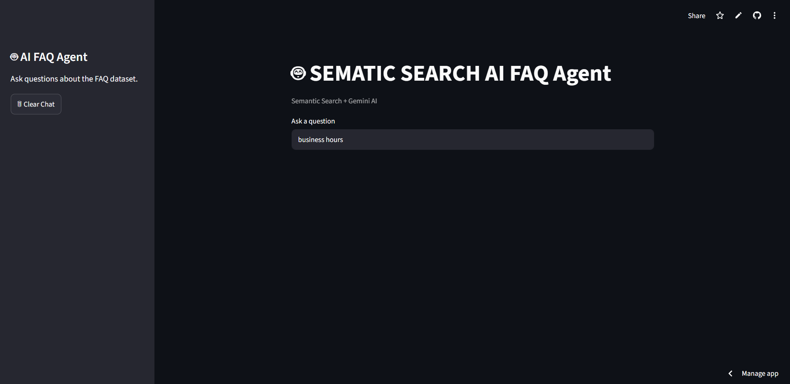
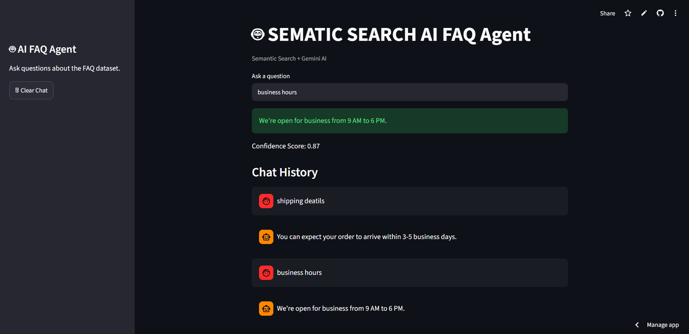

# 🤖 # 🤖 SEMANTIC FAQ AI

AI-Powered FAQ Assistant using Semantic Search and Google Gemini

The application uses Semantic Search to find the most relevant answer from a FAQ dataset and then enhances the response using Gemini AI to make it more natural and user-friendly.

---
## 🌐 Live Demo

https://ai-faq-agent-und9f2dmsgvf8w4xysxdyd.streamlit.app/

---
## Demo Screenshots

### Home Page



### Generated Response 




## 🚀 Features

* Semantic Search using Sentence Transformers
* Gemini AI Response Enhancement
* Confidence Score Filtering
* CSV Upload Support
* Chat History
* Streamlit Web Interface
* Cached Model Loading
* Environment Variable Security (.env)

---

## 🛠️ Tech Stack

* Python
* Streamlit
* Pandas
* Sentence Transformers
* Google Gemini API
* Python Dotenv
* Git & GitHub

---

## ⚙️ How It Works

1. Upload a FAQ CSV file.
2. Ask a question.
3. The question is converted into embeddings.
4. Cosine similarity finds the most relevant FAQ.
5. Confidence score is checked.
6. Gemini rewrites the answer in a friendly and professional tone.
7. The response is displayed and stored in chat history.

---

## 📂 Example Questions

* Shipping time?
* Money back?
* Contact support?
* How do I reach customer service?
* What is your refund policy?

---

## 📦 Installation

```bash
pip install -r requirements.txt
```

---

## ▶️ Run Locally

```bash
streamlit run app.py
```

---

## 🔐 Environment Variables

Create a `.env` file in the project root:

```env
GEMINI_API_KEY=YOUR_API_KEY_HERE
```

---

## 📈 Future Improvements

* Better UI/UX
* Deployment
* Database Support
* Multi-file Knowledge Base
* Conversation Memory
* Support for Multiple LLM Providers

---

## 🧠 Project Architecture

```text
User Question
      ↓
Sentence Transformer
      ↓
Embedding
      ↓
Cosine Similarity
      ↓
Best FAQ Match
      ↓
Confidence Check
      ↓
Gemini Enhancement
      ↓
Final Response
      ↓
Chat History
```

---
## 🎯 Skills Demonstrated

- Natural Language Processing (NLP)
- Semantic Search
- Sentence Embeddings
- Cosine Similarity
- LLM Integration
- API Handling
- Streamlit Development
- Cloud Deployment
- Git & GitHub

---
## 👨‍💻 Author

**Utkarsh**

Built as a hands-on AI/ML learning project to explore Semantic Search, Embeddings, Streamlit, GitHub, and LLM Integration.
